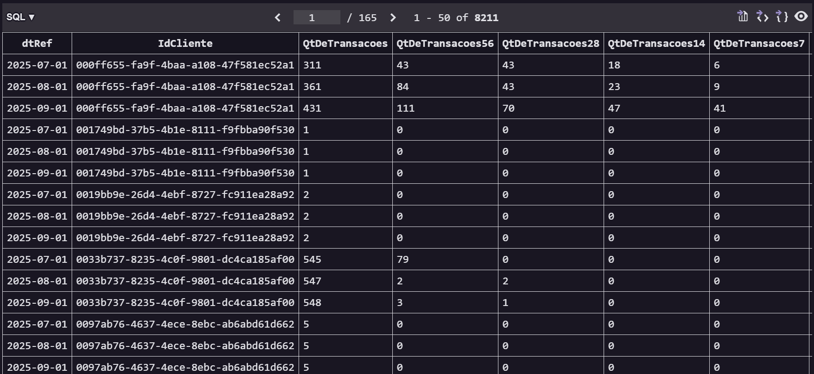
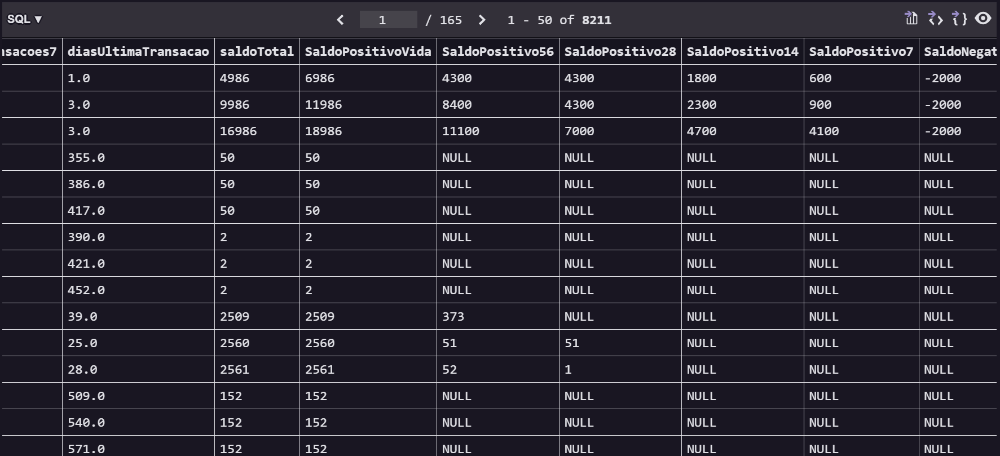
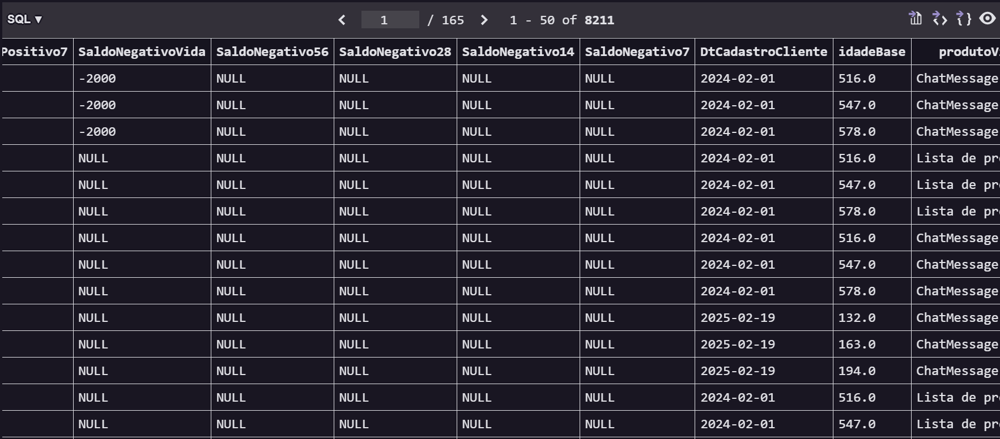
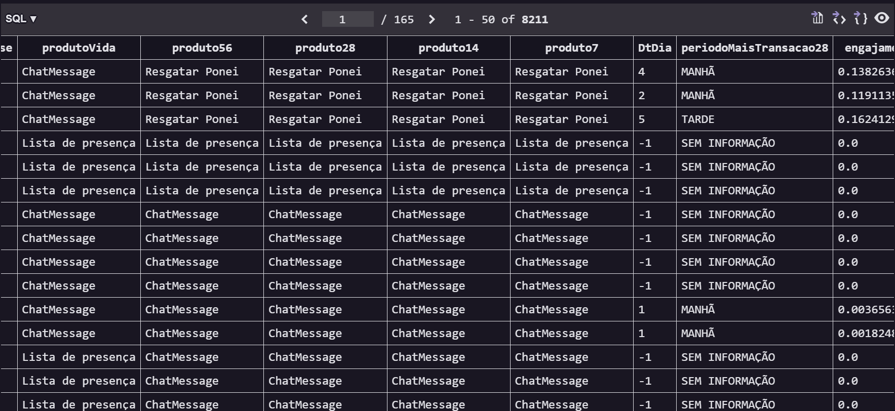

# 📚 Repositório de Estudos em SQL

Este repositório foi criado para armazenar e organizar todos os meus arquivos de estudo e projetos em SQL.

O que você encontrará aqui:

Scripts e Consultas: Códigos para a criação de tabelas, inserção de dados e consultas diversas.

Exercícios: Resoluções de desafios práticos para reforçar o aprendizado.

Anotações: Minhas anotações e explicações de cada conteúdo

Base do Conteúdo: Todo o material aqui é baseado no excelente curso "SQL 2025 do Teo Me Why, que serve como guia de aprendizado.

## Projeto final

Construção de uma tabela feature-store com o perfil comportamental dos nossos usuários

- Quantidade de transações históricas (vida, D7, D14, D28, D56)

- Dias desde a última transação

- Idade na base

- Produto mais usado (vida, D7, D14, D28, D56)

- Saldo de pontos atual

- Pontos acumulados positivos (vida, D7, D14, D28, D56)

- Pontos acumulados negativos (vida, D7, D14, D28, D56)

- Dias da semana mais ativos (D28)

- Período do dia mais ativo (D28)

- Engajamento em D28 versus Vida

### Link da tabela no docs google

[Link- Planilha](https://docs.google.com/spreadsheets/d/1bckzxH3eTIBUOtssRZ9S3FKOzL0a8BCguFzLE9eT32U/edit?usp=sharing)

### Prints

